# SIGLAT-API

Emergency Response System Backend API built with ASP.NET Core 8.0

## System Architecture


## Quick Start

```bash
# Clone and setup
git clone git@github.com:Siglat/SIGLAT-API.git
cd SIGLAT-API
dotnet restore

# Configure environment
cp .env.example .env  # Edit with your settings

# Run migrations and start
dotnet ef database update
dotnet run
```

## Tech Stack

- **ASP.NET Core 8.0** - Web API framework
- **PostgreSQL** - Primary database
- **Entity Framework Core** - ORM
- **JWT Authentication** - Security
- **Docker** - Containerization

## Project Structure

```
├── Controllers/          # API endpoints
│   ├── Alert/           # Emergency alerts (BFP, PNP, SIGLAT)
│   ├── Calamity/        # Disaster management
│   ├── Feature/         # Chat system
│   ├── Interactor/      # User management
│   └── Reports/         # Incident reporting
├── Models/              # Data models
├── Services/            # Business logic
├── Data/                # Database context
└── Migrations/          # Database migrations
```

## API Endpoints

### API Flow Chart

```mermaid
graph LR
    User[User] --> Auth{Authentication}
    Auth -->|Login/Register| JWT[JWT Token]
    JWT --> API[Protected Endpoints]
    
    API --> Reports[📊 Reports]
    API --> Chat[💬 Chat]
    API --> Admin[👨‍💼 Admin]
    API --> Alerts[🚨 Alerts]
    
    Reports --> CreateR[Create Report]
    Reports --> ListR[List Reports]
    Reports --> GetR[Get Report]
    
    Chat --> SendM[Send Message]
    Chat --> GetM[Get Messages]
    
    Admin --> ManageU[Manage Users]
    Admin --> VerifyU[Verify Users]
    
    Alerts --> BFP[🔥 Fire Protection]
    Alerts --> PNP[👮 Police]
    Alerts --> Emergency[🆘 Emergency]
```



### Authentication
- `POST /api/v1/auth/register` - User registration
- `POST /api/v1/auth/login` - User login
- `GET /api/v1/auth/profile` - Get profile

### Reports
- `GET /api/v1/report` - List reports
- `POST /api/v1/report` - Create report
- `GET /api/v1/report/{id}` - Get report

### Admin
- `GET /api/v1/admin/users` - Manage users
- `PUT /api/v1/admin/users/{id}/verify` - Verify user

### Chat
- `GET /api/v1/chat` - Get messages
- `POST /api/v1/chat` - Send message

## Database Schema


Create `.env` file:

```env
JWT_SECRET=your-256-bit-secret-key
JWT_ISSUER=SIGLAT-API
JWT_AUDIENCE=SIGLAT-Client
DATABASE_URL=Host=localhost;Database=siglat;Username=postgres;Password=password
```

## Development

```bash
# Run development server
dotnet watch run

# Create migration
dotnet ef migrations add MigrationName

# Update database
dotnet ef database update

# View API docs
# Navigate to https://localhost:7045/swagger
```

## Docker

```bash
# Build and run
docker build -t siglat-api .
docker run -p 5069:80 siglat-api
```

## Current Status

### Implementation Progress


### Feature Status Chart

```mermaid
gantt
    title SIGLAT API Development Timeline
    dateFormat  X
    axisFormat %s
    
    section Core Features
    Authentication & JWT     :done, auth, 0, 3
    Database & Migrations    :done, db, 0, 4
    User Management         :done, users, 0, 3
    
    section Current Features
    Report System           :done, reports, 3, 2
    Chat Messaging          :done, chat, 4, 2
    Admin Panel            :done, admin, 5, 2
    
    section In Development
    Emergency Alerts        :active, alerts, 6, 3
    BFP Integration        :active, bfp, 7, 2
    PNP Integration        :active, pnp, 7, 2
    
    section Planned
    Real-time Notifications :planned, realtime, 9, 2
    Disaster Management     :planned, disaster, 10, 3
    Analytics Dashboard     :planned, analytics, 11, 2
```

✅ **Implemented**
- User authentication & authorization
- Report management system
- Chat messaging
- Admin user management
- Database migrations

⚠️ **In Progress**
- Emergency alert controllers (BFP, PNP, SIGLAT)
- Disaster management endpoints (Flood, Typhoon)
- Real-time notifications

🔄 **Planned**
- Advanced analytics
- Push notifications
- Mobile app integration

## Contributing

1. Fork the repository
2. Create feature branch (`git checkout -b feature/name`)
3. Commit changes (`git commit -m 'Add feature'`)
4. Push to branch (`git push origin feature/name`)
5. Open Pull Request

## License

ISC License

---

**SIGLAT** - Sistema Integrated Geographic Location Alert and Tracking